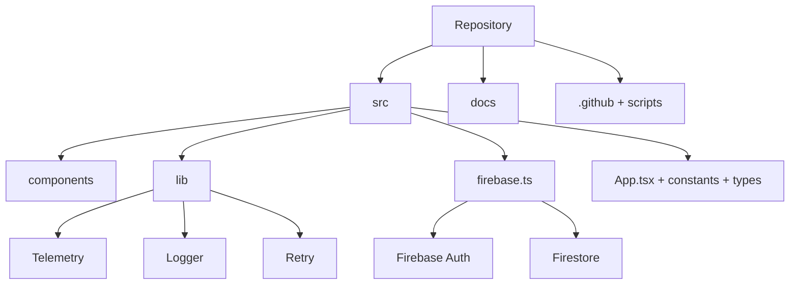

# Orchade Engineering Dashboard

Orchade is a Vite + React orchard simulation backed by Firebase Auth and Firestore. This repository is being shaped into a GitHub-native engineering control panel so maintainers can review state, risk, and progress from the repository home page.

## Project Status

| Area | Status | Signal |
| --- | --- | --- |
| App build | Passing locally | `npm run build` succeeds with bundle-size and CSS import warnings |
| Type safety | Passing locally | `npm run lint` runs TypeScript `--noEmit` |
| Tests | Not established | Test runner and journey tests are next priority |
| Security | Needs rule tests | Dependency audit is automated as a repository-health signal; strict failure is opt-in for release gates |
| Performance | At risk | Initial JS bundle is above Vite's default 500 KB warning threshold |
| Documentation | Improving | Dashboard, index, ADRs, health, and architecture maps added |

## Current Milestone

**Milestone: GitHub-Native Engineering Repository**

Goal: make GitHub communicate what changed, why it changed, what systems are affected, and what needs attention without requiring a source-code read-through.

## Latest Completed Work

- Added repository health, architecture, security, testing, and technical-debt documentation.
- Added telemetry, structured logging, runtime config validation, and retry helpers.
- Added CI, Dependabot, PR standards, issue templates, labels, CODEOWNERS, metrics, changelog, engineering log, and architecture map documentation.

## Latest Commits Summary

| Commit | Summary | Systems affected |
| --- | --- | --- |
| `6d88090` | Build self-maintenance foundation | Docs, telemetry, Firebase logging, CI, scripts |
| `1ef86c7` | Add weather forecast system | Gameplay, state, UI |
| `d66e1b0` | Add haptic audio feedback on plant select | Encyclopedia, UI, audio feedback |

## Open Blockers

1. `game-repo/` duplicates root app files; choose one source of truth before broad refactors.
2. No automated test runner or coverage report is installed.
3. Firestore rules need automated security tests.
4. Production bundle needs code splitting and bundle budgets.
5. Dependency audit findings are reported without blocking repository visibility checks; strict release gates can set `STRICT_AUDIT=true`.

## Current Branch

`work`

## Build Status

GitHub Actions runs lint, build, dependency audit, repository statistics, markdown validation, link validation, dead-code detection, unused-asset detection, and documentation generation checks. See `.github/workflows/ci.yml`.

## Known Issues

- Initial JS bundle is large.
- CSS emits an import-order warning for remote Google Fonts.
- Some dependencies may be unused by the root runtime path.
- Repository-health output is generated and should be refreshed before releases.

## Next Objectives

1. Add Vitest/React Testing Library smoke tests for critical user journeys.
2. Add Firebase Emulator rule tests.
3. Resolve duplicated `game-repo/` source tree ownership.
4. Introduce lazy boundaries and bundle-size budgets.
5. Replace remaining raw console usage in UI code with structured logging.

## Roadmap Progress

| Phase | Focus | Progress |
| --- | --- | --- |
| Repository visibility | README dashboard, changelog, logs, templates | In progress |
| Validation | CI, lint, build, audits, docs checks | In progress |
| Testing | Unit/integration/workflow tests | Not started |
| Performance | Bundle, rendering, assets, fonts | Audited |
| Reliability | Error handling, retry, telemetry | Foundation added |

## Architecture Map

## Directory Overview

| Path | Responsibility |
| --- | --- |
| `src/` | Active React application, state orchestration, Firebase integration |
| `src/components/` | Reusable UI components for plant cards, visualization, encyclopedia |
| `src/lib/` | Platform maintenance utilities: config, logging, retry, telemetry |
| `docs/` | Engineering dashboard details, architecture, logs, ADRs, metrics |
| `.github/` | GitHub-native workflows, templates, ownership, labels |
| `scripts/` | Repository health, stats, docs, and local hook automation |
| `game-repo/` | Duplicated app snapshot requiring source-of-truth decision |

## Quick Links

- [Documentation index](docs/index.md)
- [Architecture overview](docs/architecture.md)
- [Architecture map](docs/architecture/repository-map.md)
- [Repository health](docs/repository-health.md)
- [Metrics](docs/metrics.md)
- [Changelog](docs/CHANGELOG.md)
- [Technical debt](docs/technical-debt.md)
- [Developer guide](docs/developer-guide.md)
- [AI activity report](docs/ai-activity.md)

## Recent Pull Requests

| PR | Status | Notes |
| --- | --- | --- |
| Build self-maintaining engineering foundation | Prepared | Added docs, telemetry, logging, CI, scripts |
| Build GitHub-native engineering repository | Prepared | Adds dashboard, templates, maps, metrics, logs |

## Development Statistics

See [docs/metrics.md](docs/metrics.md) for tracked files, LOC, docs coverage, largest modules, TODOs, and PR/issue metric placeholders.
