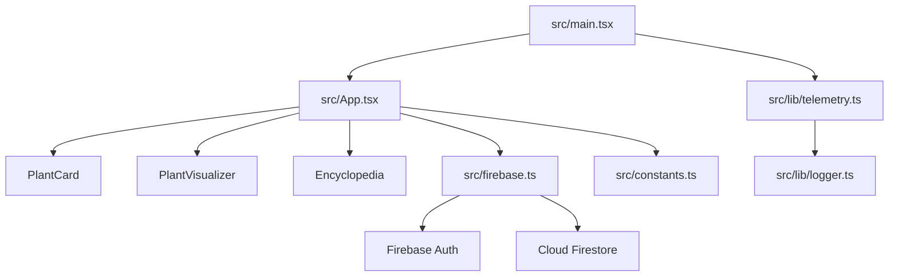

# Orchade Architecture

## System Overview

Orchade is a browser game and orchard management simulation delivered as a Vite React SPA. The client owns rendering, local interaction state, Firebase authentication, and Firestore persistence.

## Component Relationships

## Data Flow

1. Browser loads Vite bundle.
2. Runtime config validates required Firebase client settings.
3. Firebase initializes Auth and Firestore.
4. Auth state determines whether a saved player document can be loaded.
5. User actions mutate React state and selected actions persist to Firestore.
6. Firestore snapshots update rankings and saved game state.

## State Flow

`App.tsx` owns the core game state: day, credits, data seeds, orchards, upgrades, active tab, weather, harvested plant types, authentication readiness, and global stats. UI components receive state through props and emit events back to the app.

## Storage

Firestore is the durable store. The client reads and writes player state, transfer activity, and leaderboard/global stats. The current app does not use IndexedDB or localStorage for offline-first persistence.

## API Layer

There is no custom HTTP API layer. Firebase SDK calls act as the application API. Retry utilities are available in `src/lib/retry.ts` for bounded retry and timeout handling around async operations.

## Events

User events include planting, watering, tool use, harvesting, transfers, navigation tabs, authentication, and logout. Platform telemetry captures startup, render, browser error, unhandled rejection, and online/offline events.

## Background Jobs

No server-side background jobs exist. Repository maintenance automation is handled by GitHub Actions and Dependabot.

## Authentication

Firebase Auth supports Google popup sign-in and anonymous guest sign-in. Auth context is included in Firestore error reports for debugging.

## Deployment

The deployable artifact is produced by `npm run build` into `dist/`. CI installs dependencies, type-checks, builds, audits production dependencies, and generates the repository-health dashboard.

## Failure Recovery

- React error boundary shows a reboot action for rendering failures.
- Global browser handlers record errors and unhandled promise rejections.
- Retry utilities provide bounded retry and timeout handling for recoverable async operations.
- Offline/online browser events are recorded for recovery diagnostics.
