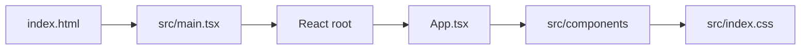

# Rendering Pipeline

Rendering is currently eager: all major UI code ships in the initial bundle. Future performance work should introduce lazy boundaries around non-critical panels and heavy visual systems.
