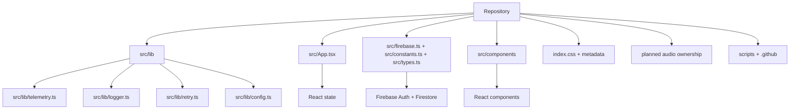

# Visual Repository Map

## Responsibility Rule

Every folder should have one owner and one primary responsibility. If a folder starts serving two unrelated purposes, split it or document the exception in an ADR.
