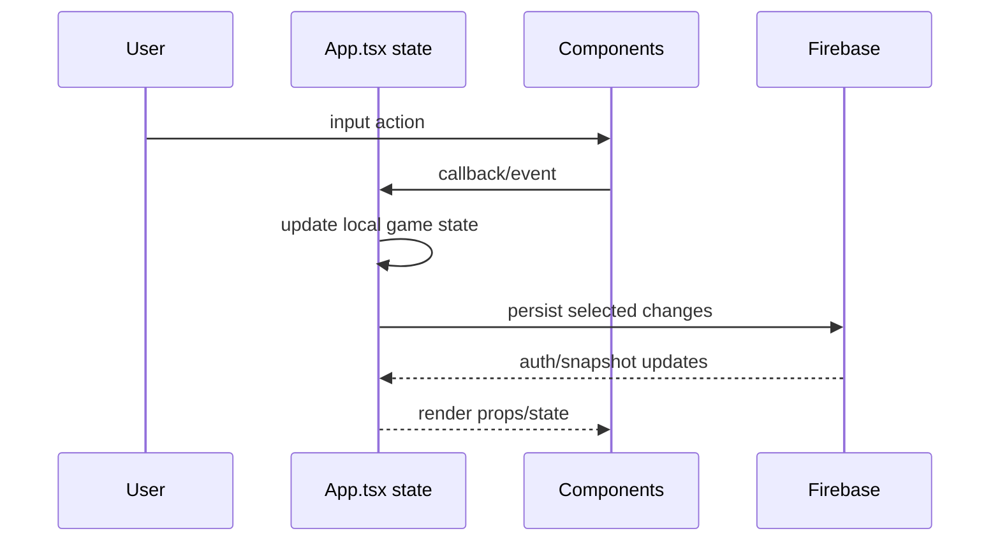

# State Flow

Core state currently lives in `App.tsx`: day, credits, data seeds, orchards, selected plant, upgrades, active tab, weather, forecast, harvested types, auth readiness, rankings, logs, and transfer form state.
